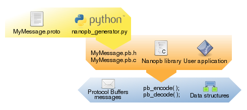
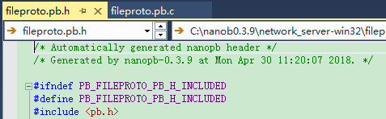

nanopb

  nanob添加Google Proobuf的C语言支持，生成c代码代码。
适合任何有内存限制的嵌入式系统，扩平台支持。

---

架构流程

---

##版本

稳定版
protobuf-3.5.1、protoc-3.5.1、nanob0.3.9

---

不要从官方提供的github下载，缺少python脚本nanopb_pb2.py和plugin_pb2.py
从官网下载
https://jpa.kapsi.fi/nanopb/download/nanopb-0.3.9-windows-x86.zip

google protobuf 更新
替换\generator\google这个文件夹

编译好的python protubuf下载地址
https://pypi.org/project/protobuf

---

补全工程工程依赖可以直接使用

第一步：生成pb文件

C:\nanob0.3.9\protoc-3.5.1-win32\bin\protoc.exe --proto——path=C:\nanob0.3.9\examples\network_server -oC:\nanob0.3.9\examples\network_ser
er\fileproto.pb fileproto.proto

第二步：生成.c和.h文件

C:\nanob0.3.9\generator\nanopb_generator.py C:\nanob0.3.9\examples\network_server\fileproto.pb

第三部：添加到工程使用。

---

例子：

windows下VS Demo例子 network_server-win32。

