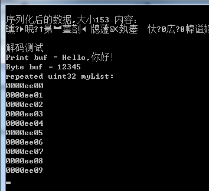

<p align="center">Study nanopb</p>


proto 文件,用于测试数据类型


```c
syntax = "proto2";

message  AllValue{
  required  float myfloat=1;
  required  int32 myint32 =2;
  required  int64 myint64=3;
  required  uint32 myuint32=4;
  required  uint64 myuint64=5;
  required  sint32 mysint32=6;
  required  sint64 mysin64=7;
  required  fixed32 myfixed32=8;
  required  fixed64 myfixed64=9;
  required  sfixed32 mysfixed32=10;
  required  sfixed64 mysfinxed64=11;
  required  bool mybool=12;
  required  string mystring =13;
  required  bytes mybytes =14;
  optional uint32 myAge=15;
  repeated uint32 myList=16;
}
```

生成的结构体，0.2.0的版本前，string的解析是使用结构体显示，后面版本统一采用结构体模式。

```c
/* Struct definitions */
typedef struct _AllValue {
    float myfloat;
    int32_t myint32;
    int64_t myint64;
    uint32_t myuint32;
    uint64_t myuint64;
    int32_t mysint32;
    int64_t mysin64;
    uint32_t myfixed32;
    uint64_t myfixed64;
    int32_t mysfixed32;
    int64_t mysfinxed64;
    bool mybool;
    pb_callback_t mystring;
    pb_callback_t mybytes;
    bool has_myAge;
    uint32_t myAge;
    pb_callback_t myList;
/* @@protoc_insertion_point(struct:AllValue) */
} AllValue;


```


```c
/////////////////////////////////////////////////////////////////////
// 保存动态的数组，这里是uint32数组，有10个数据
// 注意数组要循环保存
// 注意bool、enum、int32、int64、uint32和uint64类型全部使用pb_encode_varint保存
bool write_repeated_list_encode_callback(pb_ostream_t *stream, const pb_field_t *field, void * const *arg)
{
	uint32_t* mydata = (uint32_t *)*arg;

	for (int i = 0; i < 10;i++)
	{
		pb_encode_tag_for_field(stream, field);
		uint64_t value = *(mydata+i);
		if (!pb_encode_varint(stream, value))
			return false;
	}
	return true;
}
```

```c
// 读取uint32数组
bool list_decode_callback(pb_istream_t *stream, const pb_field_t *field, void **arg)
{
	uint64_t value;
	if (!pb_decode_varint(stream, &value))
		return false;

	*(uint32_t*)*arg = value; // 给当前值复制
	((uint32_t*)*arg)++;  // 注意这里数值移动到下一位,注意因为是uint32_t数组，对应uint32_t*转换
	return true;
}

```





